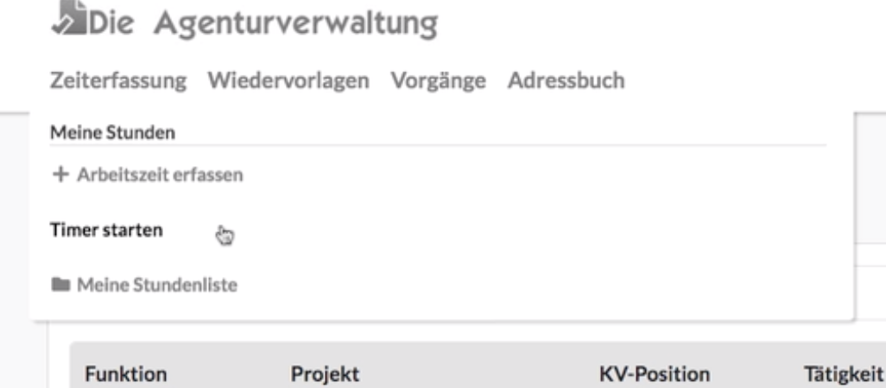
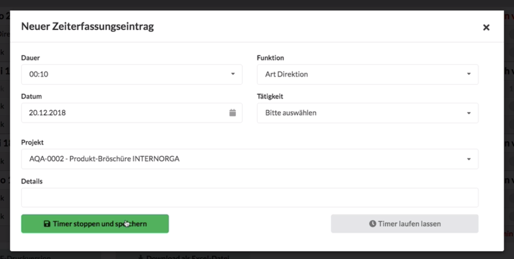
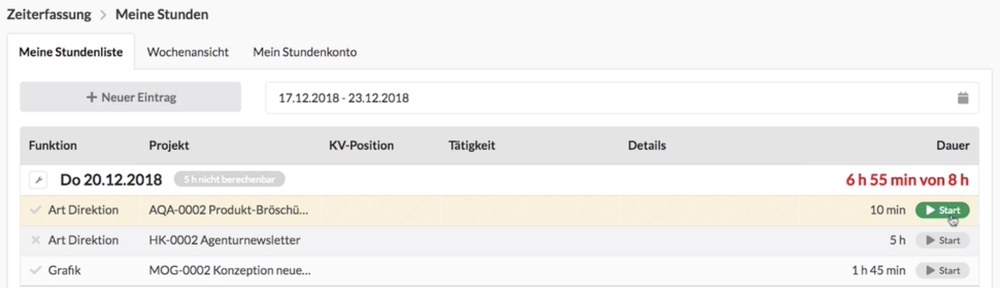
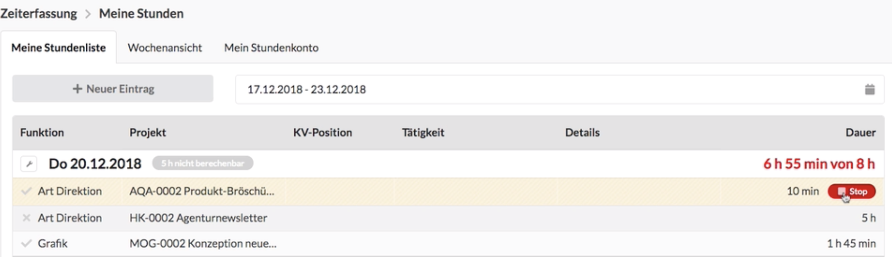
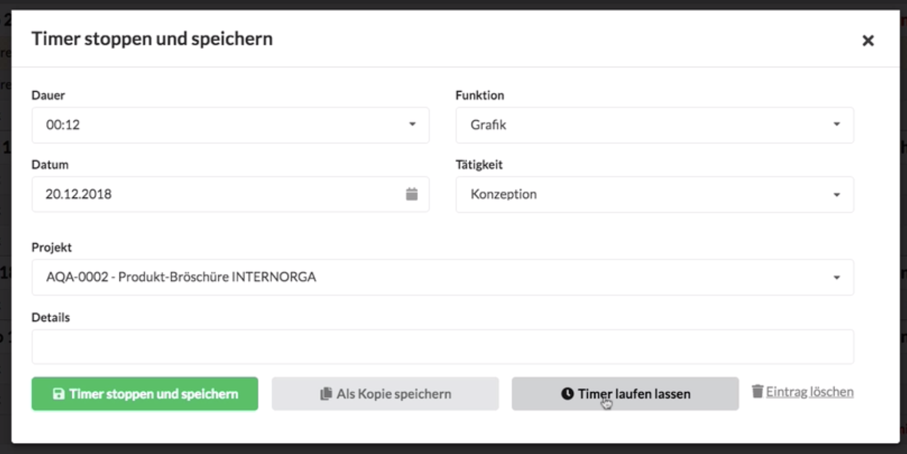

# Timer

Das ist vor allem sinnvoll, wenn wir innerhalb eines Tages viel zwischen unterschiedlichen Projekten hin und her springen und unsere Zeiten möglichst exakt erfassen wollen.

Ein Timer ist eine Stoppuhr, die jeder Benutzer für sich laufen lassen kann, um seine Arbeitszeit zu erfassen. Der Timer kann auf verschiedene Weise gestartet werden.

In dem nachfolgenden Video erfahren wir, wie die Zeiterfassung mit dem Timer funktioniert. Solltet ihr diesen Inhalt lieber lesen wollen, scrollt einfach über das Video hinweg.



Wenn wir mit einer neuen Tätigkeit beginnen, können wir den Timer einfach aus dem Menü starten. Wir sehen dann im Menü, dass gerade ein Timer im Hintergrund läuft. Diese Seite können wir dann verlassen und später zurückkehren.   

Zu einem späteren Zeitpunkt stoppen wir den Timer einfach aus dem Hauptmenü heraus. Es öffnet sich ein Dialog, in dem wir Projekt, Funktion und weitere Details angeben können. Anschliessend speichern wir den Eintrag.  

Wir können den Timer auch direkt aus der Zeiterfassungsliste starten um eine Aktivität fortzusetzen, indem wir auf die Schaltfläche "Start" drücken.


**Hinweis:** Nutzen wir die Schaltfäche "Start" an einem Eintrag, der nicht das heutige Datum hat \(z.B. um eine Aktivität von gestern fortzusetzen\), wird ein neuer Eintrag als Kopie davon zum heutigem Datum angelegt. Die Dauer dieses Eintrags startet dann bei Null.


Über die Schaltfläche "Stop" beenden wir den Timer und können ggf. weitere Details für die Zeiterfassung ergänzen. Abschliessend speichern wir den Eintrag.

## Zeiterfassung mit dem Timer: ein Beispiel

## Weitere Tipps:

* Läuft kein Timer, können wir auch einen Eintrag in der Liste öffnen, Ergänzungen vornehmen und den Timer für diesen Eintrag dann aus dem Dialog erneut starten.
* Bei einem laufenden Eintrag können wir auch eine Änderung vornehmen. Dazu verwenden wir den Button "Timer weiterlaufen lassen" im Dialog.


**Hinweis:** Nutzen wir die Schaltfäche "Start" an einem Eintrag, der nicht das heutige Datum hat \(z.B. um eine Aktivität von gestern fortzusetzen\), wird ein neuer Eintrag als Kopie davon zum heutigem Datum angelegt. Die Dauer dieses Eintrags startet dann bei Null. Auf diese Weisen können Projektmitarbeiter komfortabel an den Aufgaben des Vortags weiterarbeiten, ohne Informationen wie Projektname oder Funktion erneut eingeben zu müssen.


