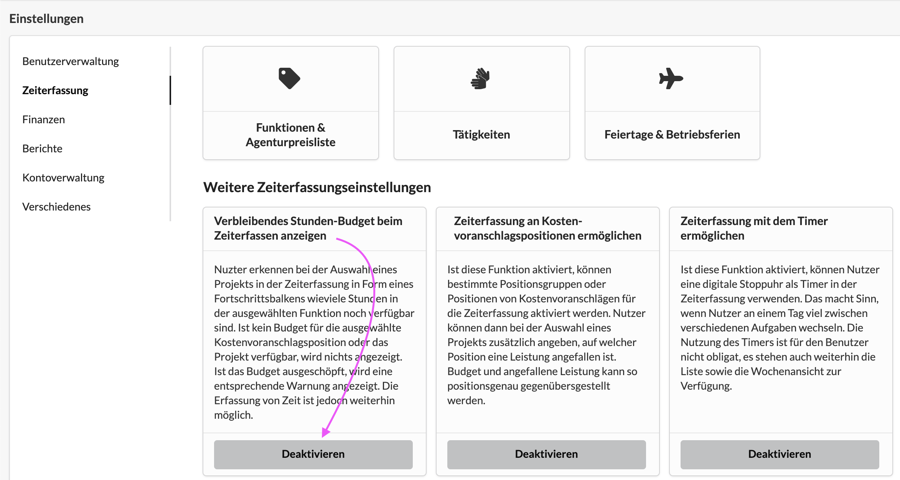
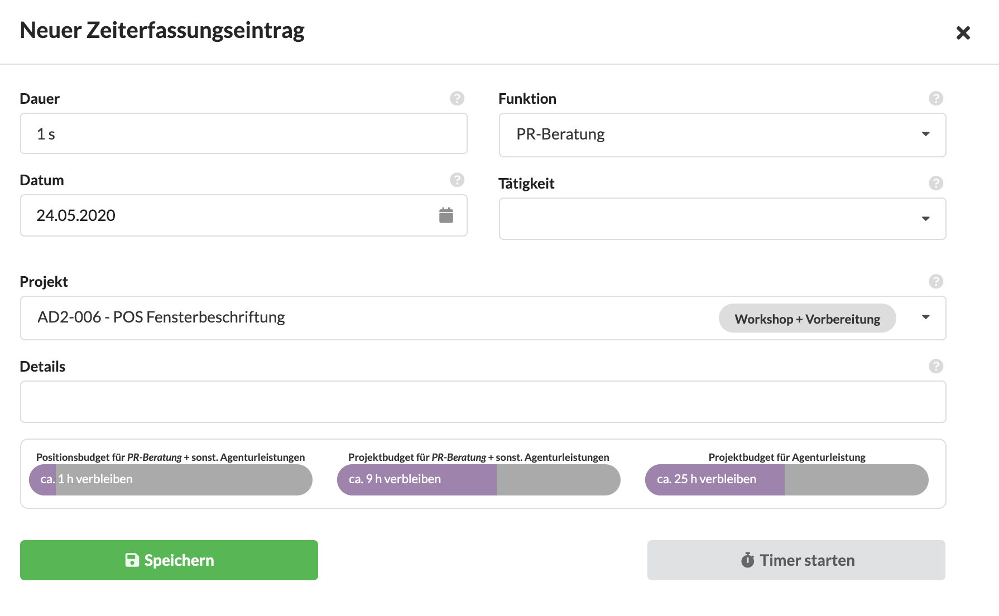

# Verbleibende Budgets beim Erfassen von Zeiten

In den Einstellungen für die Zeiterfassung kann aktiviert werden, ob Nutzer beim Erfassen der Zeit einen Einblick in das verbleibende Budget des Projekts für das sie gerade Zeit erfassen erhalten sollen.

Dafür muss die Grundeinstellung im System aktiviert sein:

Wähle ich dann in der Zeiterfassung ein Projekt aus, erscheinen bis zu drei Budget-Fortschrittsbalken.

a\) das verbleibende Budget in der ausgewählten Funktion an der ausgewählten Kostenvoranschlags-Position \(wenn das im so Projekt konfiguriert ist\)

b\) das verbleibende Projekt-Budget in der ausgewählten Funktion \(z.B. Grafikdesigner\)

c\) das verbleibende Projekt-Budget für Agenturleistung insgesamt.

Die verbleibenden Werte werden in Stunden angegeben und repräsentieren auf voll Stunden aufgerundet den bisher ermittelten durchschnittlichen Stundensatz im Verlauf des Projekts.

