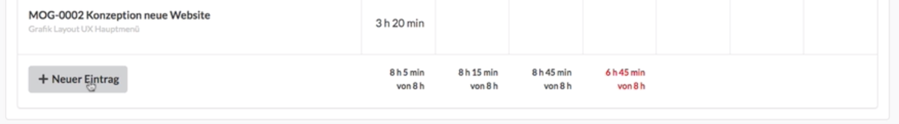

# Wochenansicht

Wir gelangen zur Wochenansicht über den Menüpunkt  Zeiterfassung &gt; Meine Stundenliste und wählen hier die Registerkarte "Wochenansicht" aus.  

Durch die Pfeiltasten rechts und links oben können wir zwischen den Wochen hin und her blättern. 

Durch einfaches Eintragen von Zeiten in diese Tabelle erzeugen wir neue Zeiterfassungseinträge an den entsprechenden Tagen oder ändern bereits eingetragene Werte. Das jeweilige Projekt und die verwendete Funktion wird in der linken Spalte angezeigt.

Über die Schaltfläche "Neuer Eintrag" kann ich eine neue Zeile in der Wochentabelle erzeugen. 

Dabei wähle ich wieder Projekt, Funktion und Tätigkeit aus und ergänze ggf. eine Notiz und speichere. Anschliessend kann ich Zeiten in die neu angelegte Zeile eintragen.

## Weitere Tipps:

In der Wochenansicht können Details von Einträgen weder bearbeitet noch gelöscht werden. Möchte ich einen Eintrag löschen, kann ich das in der Ansicht "Meine Stundenliste" tun.

