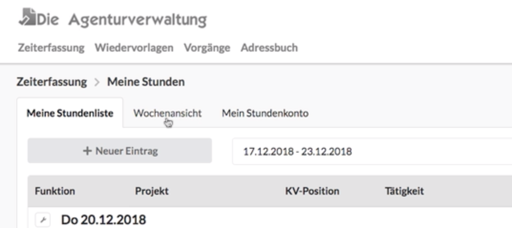
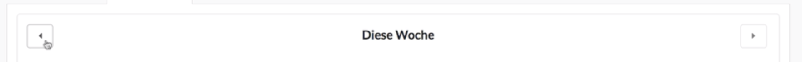
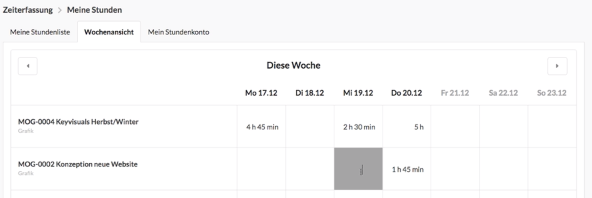
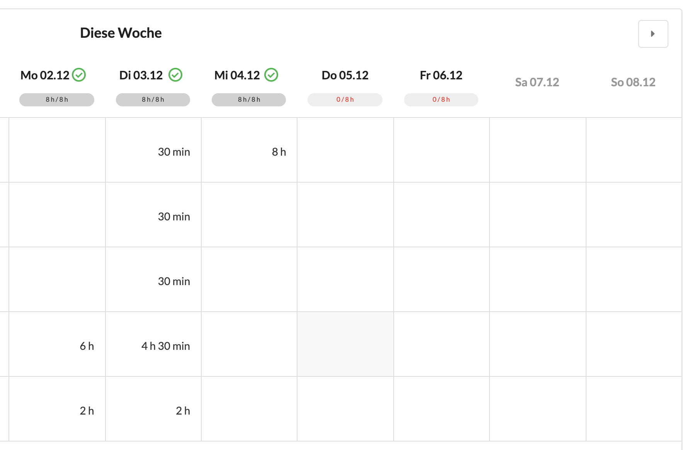
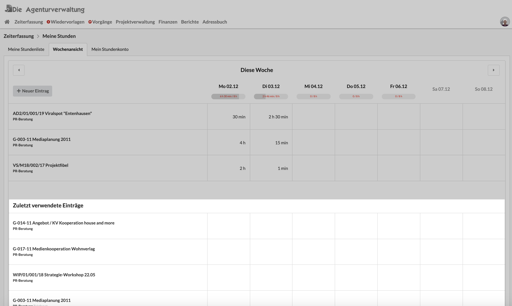

# Wochenansicht

Wir gelangen zur Wochenansicht über den Menüpunkt  Zeiterfassung &gt; Meine Stundenliste und wählen hier die Registerkarte "Wochenansicht" aus.  

Durch die Pfeiltasten rechts und links oben können wir zwischen den Wochen hin und her blättern. 

Durch einfaches Eintragen von Zeiten in diese Tabelle erzeugen wir neue Zeiterfassungseinträge an den entsprechenden Tagen oder ändern bereits eingetragene Werte. Das jeweilige Projekt und die verwendete Funktion wird in der linken Spalte angezeigt.


**Folgende Eingabeformate werden erkannt**  
`15    => 15 min  
0.25  => 15 min  
1,    => 1 h  
1:00  => 1h  
100   => 1h  
1,5   => 1 h 30 min  
130   => 1 h 30 min  
1 30  => 1 h 30 min  
02:45 => 2 h 45 min  
245   => 2 h 45 min  
2,75  => 2 h 45 min`


### Neue Zeile hinzufügen

Über die Schaltfläche "Neuer Eintrag" kann ich eine neue Zeile in der Wochentabelle erzeugen. 

Dabei wähle ich wieder Projekt, Funktion und Tätigkeit aus und ergänze ggf. eine Notiz und speichere. Anschliessend kann ich Zeiten in die neu angelegte Zeile eintragen.


**Tipp:** Schau dir die gerade gemachten Einträge aus der Wochenliste einmal in der normalen Stundenliste an. Du siehst, dass für jedes Kästchen in der Wochenliste ein eigener Eintrag in der Stundenliste hinterlegt wurde. Die Einträge hängen miteinander zusammen und können in jeder der beiden Ansichten verändert werden.


### Tagessummen

Festangestellt Mitarbeiter sehen oben am Tagesdatum auch, ob sie die in ihrem Arbeitsvertrag vereinbarte Stundensumme erreichen, oder ob noch Einträge für den jeweiligen Tag fehlen.

### Kürzlich genutzte Einträge wiederverwenden

Unterhalb der Einträge dieser Woche schlägt das System mir auch Einträge vor, die ich kürzlich verwendet habe. Diese Einträge kann ich genau so nutzen wie die Einträge oben, an denen ich bereits arbeite.

### Ändern von Projekt, Funktion oder Details


In der Wochenansicht können Details von Einträgen weder bearbeitet noch gelöscht werden. Möchte ich das tun, kann ich das in der Ansicht "Meine Stundenliste" tun.


## Zeiterfassung in der Wochenansicht: Ein Beispiel

